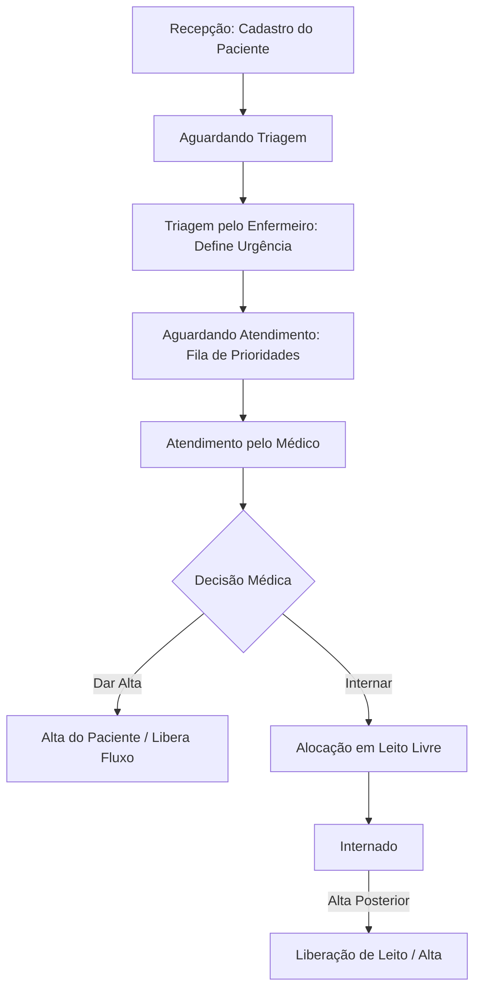

# 🏥 MedFlow - Sistema de Gestão Hospitalar e Triagem (Protocolo de Manchester)

[](https://openjdk.org/)
[](https://docs.oracle.com/javase/tutorial/uiswing/)
[](https://maven.apache.org/)
[](https://en.wikipedia.org/wiki/Multitier_architecture)

O **MedFlow** é um sistema desktop em Java desenvolvido para gerenciar e otimizar todo o fluxo de atendimento em uma unidade de saúde. O projeto simula com fidelidade a rotina real de um hospital ou Unidade de Pronto Atendimento (UPA), organizando a fila de atendimento médico pelo nível de gravidade clínica com base no **Protocolo de Manchester**.

O sistema foi estruturado de forma didática com foco em **Programação Orientada a Objetos (POO)** e **Arquitetura em Camadas (Decoupled Layers)**, sendo ideal para apresentações acadêmicas e portfólios no GitHub.

---

## 📋 Fluxo do Sistema



1. **Recepção:** O paciente é registrado no sistema (status `Aguardando Triagem`).
2. **Triagem:** Um enfermeiro realiza a avaliação clínica inicial e atribui uma cor do **Protocolo de Manchester**:
   - 🔴 **Vermelho (Emergência):** Prioridade máxima. Atendimento imediato.
   - 🟡 **Amarelo (Urgência):** Prioridade intermediária.
   - 🟢 **Verde (Pouco Urgente):** Fila padrão.
3. **Fila Médica:** Os pacientes são ordenados dinamicamente na fila por cor de prioridade e, em caso de empate, pelo horário de chegada (ordem cronológica).
4. **Atendimento & Internação:** O médico atende os pacientes seguindo a ordem da fila. Ele pode conceder alta direta ou alocar o paciente em um leito livre (Enfermaria ou UTI). Posteriormente, o paciente pode receber alta e liberar o leito.

---

## 🛠️ Arquitetura do Sistema (5 Camadas)

O projeto segue um padrão rígido de divisão de responsabilidades, garantindo baixo acoplamento e alta coesão:

```
 hospital/
 ├── model/         --> Classes de entidade (POJOs), Enums e classes abstratas.
 ├── repository/    --> Responsável por ler e gravar dados em arquivos texto (.txt) (Mock DB).
 ├── service/       --> Concentra as regras de negócio, validações e tratamento de exceções.
 ├── controller/    --> Intermedia o fluxo entre a View e o Service, isolando a interface gráfica.
 └── view/          --> Componentes visuais Swing e a janela principal (MainFrame).
```

* **`hospital.model`:** Contém as classes que mapeiam o domínio do sistema: `Paciente`, `Leito`, `ProfissionalSaude` (classe abstrata), `Medico`, `Enfermeiro`, e os enums `CorTriagem` e `StatusPaciente`.
* **`hospital.repository`:** Camada de persistência que simula um banco de dados utilizando arquivos de texto plano (`pacientes.txt`, `profissionais.txt`, `leitos.txt`). Garante que os dados cadastrados não sejam perdidos ao reiniciar o aplicativo.
* **`hospital.service`:** O "cérebro" do sistema. Gerencia as regras de negócio, as filas de triagem prioritárias, alocação de leitos e faz o lançamento de exceções específicas da aplicação.
* **`hospital.controller`:** Centraliza as ações acionadas pela View e chama as rotinas da camada Service, mantendo a interface puramente dedicada à renderização visual.
* **`hospital.view`:** Interface gráfica construída em **Java Swing** (`MainFrame.java`), desenvolvida para ser limpa, intuitiva e fácil de explicar em apresentações acadêmicas.

---

## 🎓 Conceitos de Programação Orientada a Objetos Aplicados

O MedFlow serve como um excelente material de estudo prático para conceitos fundamentais de POO:

| Conceito | Aplicação Prática no Código |
| :--- | :--- |
| **Abstração & Herança** | A classe abstrata `ProfissionalSaude` define os campos comuns a todos os profissionais (id, nome, login, senha) e métodos abstratos como `getTipo()`. As classes `Medico` e `Enfermeiro` estendem esta base e implementam comportamentos e atributos específicos (ex: CRM, Especialidade, COREN). |
| **Polimorfismo** | Métodos como `toString()`, `getTipo()` e `getInfoAdicional()` são sobrescritos (`@Override`) nas subclasses. A camada de persistência armazena e lê os objetos polimorficamente a partir da lista base de `ProfissionalSaude`. |
| **Sobrecarga (Overloading)** | A entidade `Paciente` possui múltiplos construtores: um completo (para carregar dados históricos persistidos no arquivo com ID definido) e um simplificado (para novos registros onde o ID é gerado automaticamente). |
| **Composição** | A classe `Leito` mantém uma referência direta ao objeto `Paciente` (`pacienteAlocado`), representando que o paciente faz parte do leito enquanto estiver internado. |
| **Agregação** | O `GerenciadorHospital` agrega e gerencia coleções dinâmicas de `Paciente`, `ProfissionalSaude` e `Leito`. |
| **Variáveis/Métodos Estáticos** | Utilização de variáveis estáticas (`Paciente.proximoId`) para controlar o auto-incremento global de IDs dos novos cadastros sem conflitos. |
| **Tratamento de Exceções** | Criação de exceções personalizadas (`FilaVaziaException`, `LeitoIndisponivelException`, `PacienteNaoEncontradoException`) para garantir um fluxo seguro de erros e mensagens claras ao usuário final. |
| **Java Streams & Lambdas** | Utilizados na busca, ordenação (comparators baseados na prioridade) e remoção de registros em listas, mantendo o código moderno e compacto. |

---

## 💾 Persistência em Arquivo (.txt)

O sistema conta com um sistema de gravação em arquivos de texto dentro do diretório `data/` na raiz do projeto. Toda alteração de dados (inclusão, edição, remoção, triagem, internação) é sincronizada imediatamente:
* `data/pacientes.txt` - Lista completa de pacientes, histórico de triagens e status atual.
* `data/profissionais.txt` - Dados de médicos, enfermeiros, senhas e registros profissionais.
* `data/leitos.txt` - Status de ocupação e vínculos de internação.

---

## 🚀 Como Executar o Projeto

### Pré-requisitos
* **Java Development Kit (JDK) 17** ou superior.
* **Apache Maven** instalado.
* (Opcional) Uma IDE com suporte a Java (NetBeans, IntelliJ IDEA, Eclipse, VS Code).

### Passo a Passo

1. **Clone o repositório:**
   ```bash
   git clone https://github.com/Luiz-Otavio-Rocha-Castro/MedFlow.git
   cd MedFlow
   ```

2. **Compile o projeto com Maven:**
   ```bash
   mvn clean compile
   ```

3. **Execute a aplicação:**
   ```bash
   mvn exec:java
   ```

4. **Gerar o arquivo executável (.jar):**
   ```bash
   mvn package
   ```
   O arquivo JAR compilado será gerado na pasta `/target/MedFlow.jar`. Você pode executá-lo diretamente com:
   ```bash
   java -jar target/MedFlow.jar
   ```

---

## 🖥️ Demonstração da Interface Gráfica

A interface gráfica foi projetada utilizando componentes nativos do Java Swing (NetBeans GUI-friendly), estruturada com painéis e tabelas dinâmicas:
* **Aba de Cadastros:** Formulários para cadastrar, editar e remover Pacientes e Profissionais de Saúde (médicos e enfermeiros), contendo tabelas com a listagem em tempo real.
* **Aba de Triagem:** Painel onde o Enfermeiro seleciona um paciente pendente e define a gravidade de Manchester.
* **Aba de Atendimento:** O Consultório do Médico. A fila prioriza automaticamente pacientes em estado grave. O médico pode prescrever alta ou internar em um leito livre.
* **Aba de Leitos:** Exibição da ocupação dos leitos em tempo real (número do leito, ala e paciente alocado).

---

## ✒️ Autores

* **Luiz Otávio** - *Desenvolvimento e Arquitetura* - [GitHub](https://github.com/Luiz-Otavio-Rocha-Castro)

---
*Desenvolvido como projeto acadêmico de Programação Orientada a Objetos.*